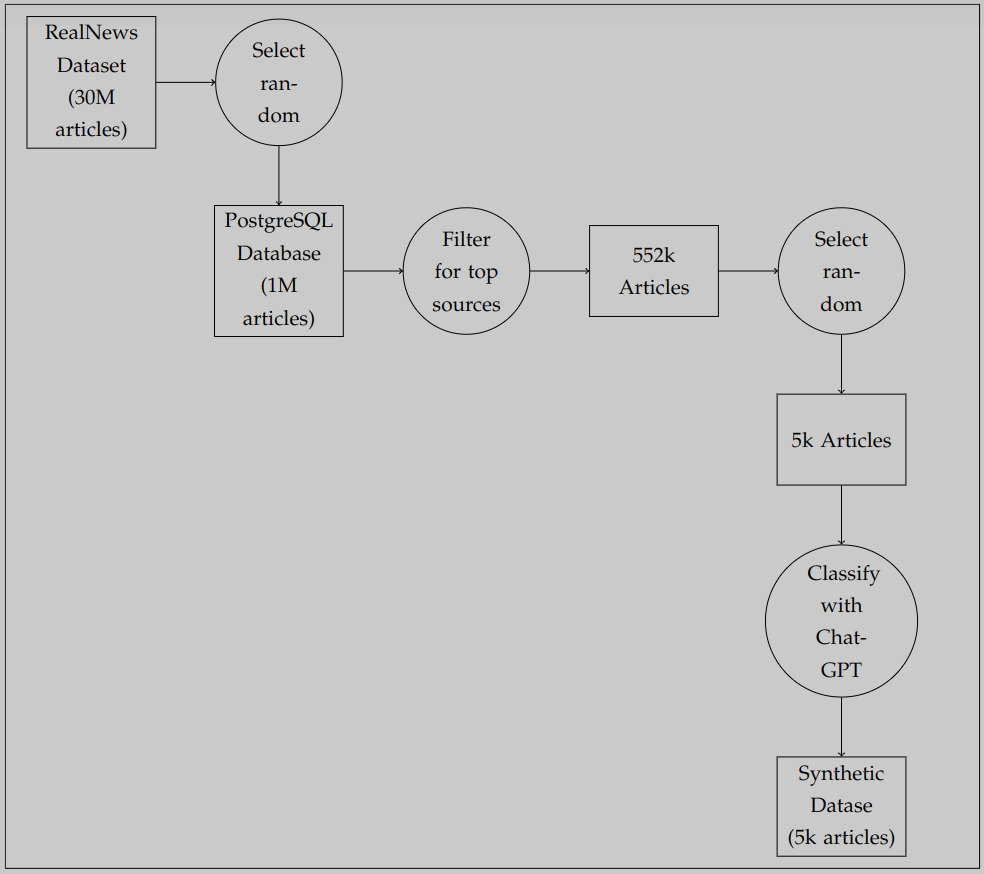
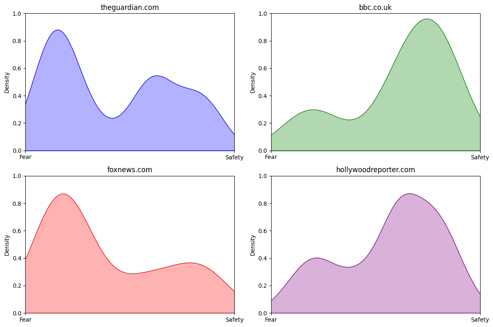
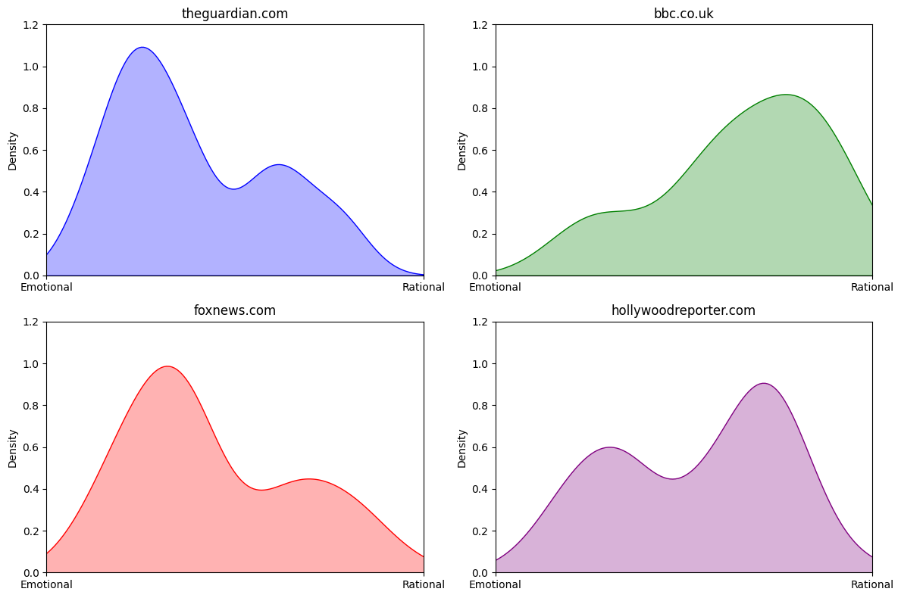
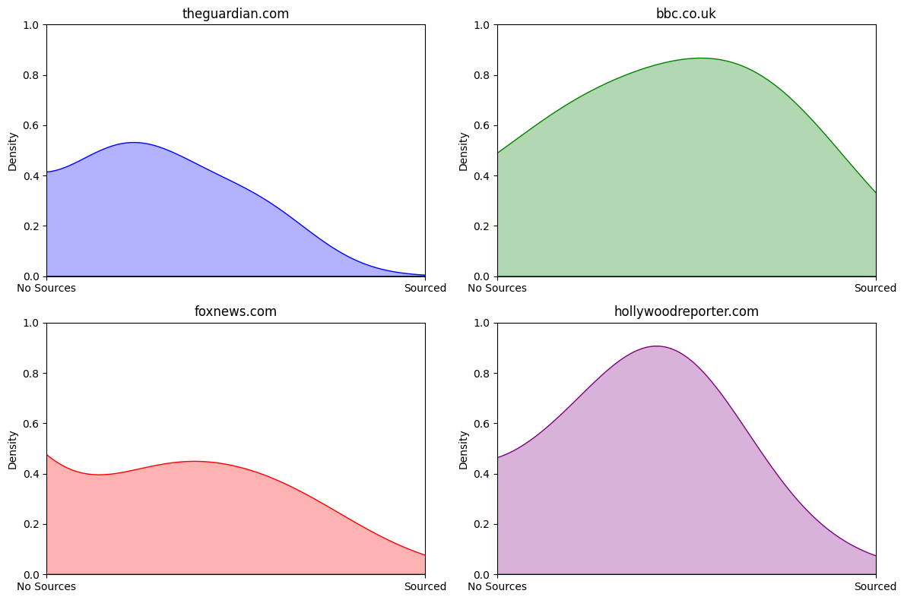

# Creating a Synthetic Classification with ChatGPT
**ATLS 5244: Empathy & Tech**  
**Graham Stewart**  
**March 17, 2024**

## Introduction

As part of my class project, I need a large dataset of new articles classified by their sentiment. Typically, such datasets undergo a meticulous manual tagging process, as exemplified by methodologies adopted by organizations like Media Bias/Fact Check. This conventional approach, while robust, is far too labor-intensive to be practical for my project.

Instead, this paper outlines my process of achieving synthetic classification using ChatGPT. Truly synthetic datasets are often used in machine learning, and I've seen examples of partially synthetic data, but this novel approach allows for synthetic classification of a real dataset.

The results seem promising, and I intend to take these forward to my final project, which will involve training a sentiment analysis model on this dataset.

## Initial Datasource Loading

The RealNews Dataset, containing around 30 million articles, served as the initial data source. I loaded the first million articles into a PostgreSQL database to streamline analysis. The creation process is illustrated below:

Note: The dataset is five years old, so it will miss some context about recent terminology that's been used to create fear in the media.

The `postgres_load.py` script is available in the project repository.

## Selecting Specific Domains

To maintain relevance to my experience, I filtered the dataset to include only top US and UK news sources, excluding publications like the Daily Star due to its sensationalist nature. This refinement resulted in 552,000 articles. I also specifically excluded the Daily Star which is a UK tabloid that's something like the National Enquirer with a lot of sensationalist stories mixed with soft porn.

## ChatGPT Request

I constructed the following request to send to ChatGPT's 3.5 Turbo model with each news story: (Here you would describe the request without the JSON block to avoid formatting issues.)

I wrote a script to pull random stories from the database and send them to ChatGPT, using python's ThreadPoolExecutor to send multiple requests at once. The script `create_synthetic.py` is available in the project repository.

Note: This is a completely subjective exercise. I'm giving ChatGPT no guidance on what constitutes a good source or what is emotional language. I'm relying on the model to make those decisions. I'm also using the model in a one-shot configuration where it has no context from any of the other decisions it's made.

I selected a total of 5000 stories at random to form the basis of my synthetic dataset - this only cost $2.78 to run on the OpenAI API.

    Can you analyze the following news story and return a json object that
    ranks the content on 3 measures
    fearsafety : where -1 is a story that would create a fear in a typical
    reader but 1 would make the reader feel safe
    opinionfact: where -1 is pure opinion and 1 is factual
    emotionalrational: where -1 is loaded with emotional language and 1 is
    rational
    diversityofsource: where 0 doesn’t refer to any sources but 1 has a
    good set of sources from each side
    return a json object like
    {
    "fearsafety":-0.43,
    "opinionfact":0.32,
    "emotionalrational":-0.33,
    "diversityofsource":0.66
    }
    Here’s the story:
    <TEXT OF STORY>

## Results

The results are not reproducible and subjective. However, looking at some of the extreme examples we can see promising results.

## Conclusion

The results of this project are promising. I have a dataset of 5000 news articles that have been classified by ChatGPT on a number of measures. This dataset will be used to train a sentiment analysis model for analyzing my media consumption.

However, there are several shortcomings:

- The model is not consistent or transparent in its classifications.
- The selected measures are entirely subjective.
- No attempt was made to ask the model to consider whether the stories might cause fear given particular concerns and political ideology.
- The dataset used for training is a few years out of date, possibly affecting the language used in the stories.

The results are exciting, and I'm looking forward to training a model on this dataset to see if it can help me make more informed choices about my media consumption.
